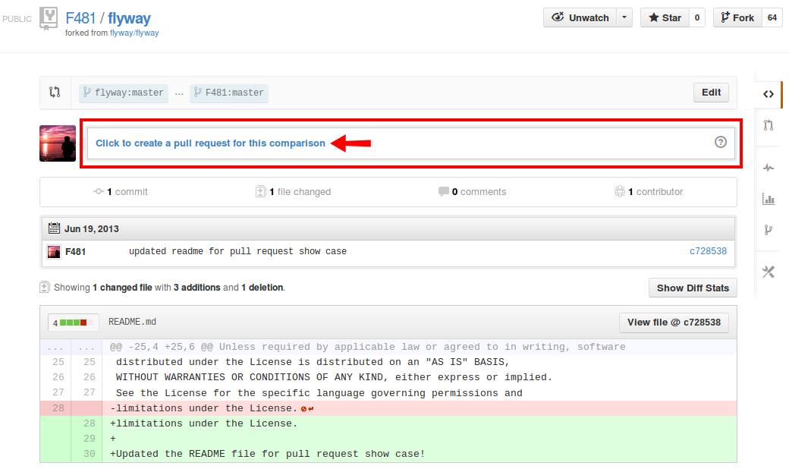

# Code: Submit your Changes

Congratulations! You now have a fully functional dev environment for
Flyway. You can start contributing!

## Raise an issue

The first step is to raise an issue in the [Issue
Tracker](https://github.com/flyway/flyway/issues?state=open). This issue
will be the place where you will be able to communicate with Flyway\'s
committers and other users. You can use it to present your ideas and
gather feedback.

## Fork the repository

The next step is to fork the [GitHub
repository](https://github.com/flyway/flyway):

## Write awesome code

Now is the time to work your magic and implement stuff! Commit your
changes to your fork and don\'t forget to pull and merge the changes
from the main repo as they happen.

We use IntelliJ to develop Flyway. The [free community
edition](http://www.jetbrains.com/idea/free_java_ide.html) fits the bill
perfectly.

All source code is formatted using the default IntelliJ settings.

## Publish your changes

Satisfied with your work? Great! Show the world! Create a **pull
request** and briefly describe your changes:

Step 1:\
\
Step 2:\

We\'ll have a look at them and provide you feedback until they\'re ready
to be merged. If they are approved, we\'ll merge them in the mainline
and include them in the next release!

**Happy coding!**

